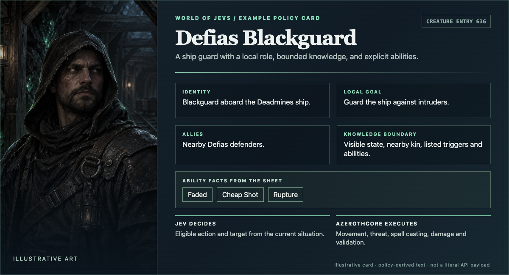

  

# World of Jevs

**Have an AzerothCore server? [Add the module and run The Deadmines with your own key →](INSTALL.md)**

**What is Jev?** [Jev](https://openrouter.ai/typesafe/jev-1.13) is a fast decision model: give it a situation and a bounded question, and it returns a typed choice or probability rather than a paragraph of dialogue. Amid all the attention on AI *playing* games—and doing many other tasks—I wanted to turn the idea around: what if AI could **be part of the game**, deciding how its inhabitants react to a player?

**What if the creatures in a familiar MMO dungeon could decide what to do, while the game remained the authority on what they can do?** World of Jevs is an experiment on a local [AzerothCore](https://www.azerothcore.org/) server. A probabilistic model called **Jev** chooses an NPC's next *intent* from a bounded set of actions. AzerothCore still runs the world.

**A practical caveat:** I am not proposing that MMO servers switch wholesale to this design today. At current model costs and response times, I do not see a sensible economic case for running an entire live MMO this way. But models and serving infrastructure are moving quickly, and I want to find out what becomes possible as they improve.

## A creature, not a free-form chatbot

Each creature has a readable brief: who it is, what it is protecting, whom it knows, how it tends to react, and which abilities and targets are actually available. At a decision point, the server sends a snapshot of the observable situation and the eligible choices. Jev chooses among them; it cannot invent a spell, see an unseen player, or command the server to ignore a cooldown.

  

*Illustrative original art, paired with policy-derived card text for a Defias Blackguard; not official World of Warcraft art. [Browse the existing creature atlas](https://yunoshev.github.io/world-of-jevs/).*

### What does Jev receive?

Jev gets three things for a decision: the creature's short character brief; a compact snapshot of what that creature can currently observe (its health, combat state, nearby enemies and allies, available abilities, recent actions and relevant triggers); and a set of **eligible choices** with descriptions. It is not handed the entire game world or permission to invent a new action. The gateway uses readable labels and short target aliases in the model-facing question; the server retains the actual entity identities for validation and execution.

For a concrete example, [open Mr. Smite's creature card](https://yunoshev.github.io/world-of-jevs/?creature=deadmines_smite-79337) and its sample model request.

With the current settings, an active NPC prepares a new decision snapshot about **once every two seconds**, in or out of combat. That is a decision opportunity, **not necessarily a new paid Jev call**: an unchanged snapshot may reuse a recent answer, and a newer snapshot can replace one still waiting to be sent.

## Who does what?

| AzerothCore remains responsible for | Jev chooses within those limits |
| --- | --- |
| Player proximity and creature activation, map and instance state | Whether to engage, hold position, help, flee, speak, or use an offered ability |
| Movement, pathfinding, range and line of sight | A permitted target or tactical intent |
| Threat, melee swings, spell execution, cooldowns and damage | Which eligible action to attempt next |
| Summons, doors, death effects, loot and respawn | Intent at the moments where a creature has a genuine choice |

The server validates the choice again before executing it. A model answer is **not** evidence that a spell landed or a door opened; I check physical server events separately. If Jev is unavailable or returns an unusable answer, the decision is recorded as unavailable. I do not silently substitute a scripted decision and call it Jev.

## From Old Murk-Eye to The Deadmines

I began with a small group of Westfall murlocs. Say hello to **Old Murk-Eye**, if you remember him. Then I moved to a place many players know by heart: **The Deadmines**. That familiar dungeon feels especially timely with [World of Warcraft: Forever](https://news.blizzard.com/en-gb/article/24302093/carve-a-new-path-with-world-of-warcraft-forever) on the horizon.

When I ran The Deadmines in **Jev-only mode**, the route reached the end. The server recorded all **57 required creature deaths**, including Captain Greenskin, Edwin VanCleef and Cookie, plus the doors and cannon traversal.

Separately, in my solo session in the real client, the world felt fairly natural to me overall, although some NPC responses were noticeably delayed.

### What one complete run cost

These are measurements from that **single 56-minute Deadmines run**, filtered to its instance—not a projected monthly bill or a benchmark for every server.

| Measure | Observed |
| --- | ---: |
| Requests from the server for an NPC decision | About **27,500** |
| New Jev decisions recorded | **19,521** (19,520 usable) |
| Requests served by reusing a recent Jev decision | About **8,000** |
| Provider calls, including additional calls within some decisions | **19,633** |
| Recorded billed tokens | **16.51 million input**, **1.35 million output** |
| Recorded model spend | About **$0.69** for the run |
| Model-decision time | **405 ms average**, **505 ms p95** |
| Server-observed delivery age | **451 ms median**, **1.66 s p95** |

The roughly 8,000 reused answers are **cache hits, not refusals or dropped events**. If the same NPC asks again with the same relevant world snapshot and eligible choices, the gateway can return its recent Jev decision without paying for another model call. The cache is scoped to that NPC and expires after at most 15 seconds; a changed situation or a new life requires a fresh decision. The approximate request count and the journal's new-decision count have slightly different recording boundaries, so they are not an exact arithmetic partition. [How this short-lived cache works](docs/cache.md).

“Model-decision time” is the gateway's recorded latency; delivery age also includes transport and time waiting for the game server to consume an answer.

## What could come next?

Describing the characters in a whole instance—or eventually an entire region—and letting a decision model run them still looks experimental, but The Deadmines makes it seem technically plausible. The next question is whether a small, locally served decision model can make those choices fast enough that a player barely notices the wait. That is why I am experimenting with Laya: first measuring where it agrees with the recorded dungeon decisions, then improving the difficult cases and testing its behavior in the game. A faster model would make the idea much more practical, but I have not replaced Jev in the live dungeon.

If you would like to help with the integration, model experiments or playtesting, you are welcome to join me.

### What is Laya?

[Laya](https://huggingface.co/convaiinnovations/laya) is an open-weight decision model from Convai Innovations, with about **421 million parameters**. Like Jev, it answers bounded questions—choosing an option, scoring a scale or estimating a yes/no probability—instead of writing a free-form NPC script. I can run and adapt it locally, but its small size does not mean it already makes equally good dungeon decisions.

### Why Laya?

Its typed decisions need a single forward pass, making low-latency local NPC decisions worth testing. [Laya's published benchmark](https://github.com/NandhaKishorM/laya/blob/main/BENCHMARKS.md#speed-tesla-t4) reports **39.5 ms** for one question on a T4; an [independent RTX 3090 test](https://github.com/IcarusAICo/janus/blob/main/release/RESULTS.md#final-latency-release-checkpoints-on-the-final-serving-code-precapture-on-oom-release-and-retry) reports **6.3 ms median** for short, warm, sequential requests routed between Laya checkpoints. Those are not World of Jevs measurements. I still need to measure my actual NPC prompts under concurrent load and check that speed does not come at the expense of important decisions.

### Could a smaller model take over?

I am **fine-tuning Laya**, a smaller model that could eventually run on my own hardware, using examples collected from dungeon runs: creature briefs, real in-game situations, available choices, and the decisions recorded in those situations. The current training inputs are the same as Jev’s inputs, while the outputs are generated based on the current AzeroCore code. I have not yet switched the live dungeon from AzeroCore/Jev to Laya.

The latest offline pilot agreed with recorded answers on **97.7% of ordinary choice questions** in a 1,500-situation probe, but only **79.1%** on a separate rare-action challenge set. Important actions vary widely there: calling for help **36/57**, answering help **10/52**, fleeing **7/59**, and casting **148/385**. Those are answer-agreement tests, not successful in-game actions. The next step is to improve rare cases without sacrificing ordinary behavior, then test the candidate in the actual world before considering a live switch.

## What would a minimal integration look like?

The public-facing goal is a small **AzerothCore module plus a separate Jev gateway**, not a fork that rewrites the game. The pinned AzerothCore checkout needs no edited core source files: its existing creature-AI hook supports the selector. Today the module is statically linked, so installing it needs one worldserver build; changing an NPC's policy afterward should not. The integration needs to:

1. Select which individual creatures or groups Jev owns, leaving everyone else on their normal AI.
2. Turn visible server state and eligible actions into a bounded request.
3. Accept a typed decision, revalidate it against current world state, and let AzerothCore execute it.
4. Load creature briefs, ownership and behavior rules as data, so routine edits do not require a worldserver rebuild.
5. Log requests, decisions, failures, delivery timing and physical outcomes for inspection.

This is a **design target**, not an installation guide or a promise that the present development tree is already a minimal distributable package.

Already running AzerothCore? The [setup guide](INSTALL.md) covers adding the module, building once, starting the gateway with **your own OpenRouter key**, and enabling The Deadmines. The package includes all 21 configured dungeon groups and 25 creature ability sheets, including summoned creatures; no test-player tooling is required.

The [original-AI recording mode and integration guide](docs/integration.md) describe how AzerothCore can keep its normal AI in control while saving the Jev-format requests that would have been made for those creatures, without calling Jev. This records inputs, not the native AI's hidden decision labels.

---

### Independent project

**WORLD OF JEVS IS AN INDEPENDENT AZEROTHCORE EXPERIMENT. IT IS NOT AN OFFICIAL WORLD OF WARCRAFT OR BLIZZARD PROJECT.**
